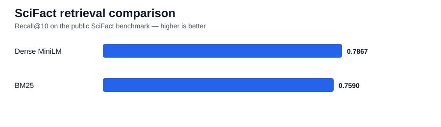

# AM2-03 — Modern Retrieval and RAG Benchmark

A comparative project covering:

**BM25 → dense retrieval → cross-encoder reranking → grounded RAG**

## Experiment status

- ✅ CI passing
- ✅ BM25 executed
- ✅ Dense MiniLM retrieval executed
- ✅ Public SciFact benchmark executed
- ✅ Real cross-encoder reranking executed
- ✅ Real Hugging Face generation executed
- ✅ Grounding/citation evidence committed

## Architecture

```text
Question
  ↓
BM25 / dense retrieval
  ↓
top-N candidates
  ↓
cross-encoder reranking
  ↓
[E1] [E2] [E3]
  ↓
grounded generator
  ↓
citation + failure analysis
```

## Key results

### Public SciFact benchmark

| Retriever | Recall@1 | Recall@3 | Recall@10 | Precision@1 | Precision@3 | MRR |
|---|---:|---:|---:|---:|---:|---:|
| BM25 | **0.4942** | **0.6700** | 0.7590 | **0.5100** | **0.2367** | **0.6041** |
| Dense MiniLM | 0.4772 | 0.6453 | **0.7867** | 0.4967 | 0.2344 | 0.5979 |



## What the retrieval results show

Dense MiniLM achieved the stronger **Recall@10**, retrieving more relevant evidence deeper in the result set. BM25 was slightly stronger at the top of the ranking, with higher Recall@1, Recall@3, Precision@1 and reciprocal rank.

This means the two methods expose a genuine engineering trade-off:

- **BM25** was marginally stronger for early precision/ranking in this benchmark.
- **Dense retrieval** recovered more relevant material within the top 10.

That is more informative than assuming semantic retrieval must always dominate lexical retrieval.

## Real RAG and grounding results

The real cross-encoder + generator run produced:

| Metric | Result |
|---|---:|
| Mean Recall@1 | **1.0000** |
| Mean reciprocal rank | **1.0000** |
| Mean citation precision | **1.0000** |
| Unsupported-citation rate | **0.0000** |
| Abstention rate | **0.0000** |

The small local RAG fixture generated citation-only outputs (`[E1]`, `[E2]`). That is enough to verify end-to-end evidence-label plumbing, but it is **not** treated as proof of semantic answer quality.

## Evaluation

### Retrieval
- Recall@1 / @3 / @10
- Precision@1 / @3
- Reciprocal Rank

### Grounding
- citation precision
- unsupported-citation detection
- abstention detection
- failure taxonomy

### Security
- prompt-injection pattern detection
- retrieved-context trust boundary

## Reproduce the experiment

Core run:

```bash
pip install -e ".[dev,dense]"
python scripts/run_bm25_demo.py
python scripts/run_dense_comparison.py
python scripts/run_reranking_rag_demo.py
pytest
```

Optional full-model run:

```bash
pip install -e ".[rerank,rag]"
python scripts/run_real_rag.py
```

Optional SciFact benchmark:

```bash
pip install -e ".[data]"
python scripts/run_scifact_comparison.py
```

## Evidence

- [Cumulative experiment summary](evidence/RESULTS.md)
- [Execution-state summary](evidence/final_project_summary.json)
- [SciFact comparison](evidence/tables/phase2_scifact_comparison.csv)
- [Real RAG outputs](evidence/tables/phase3_real_rag.csv)
- [How to run the real experiment](docs/running_real_experiment.md)

## Documentation

See `docs/` for retrieval methodology, grounded RAG design, model card, security considerations, deployment/MLOps and AM2 evidence.

## Responsible use

Citation presence does not prove that a generated claim is semantically supported by the cited text. Retrieved content must also be treated as untrusted input.

## Licence

Code: MIT. External datasets and models retain their original licences.
